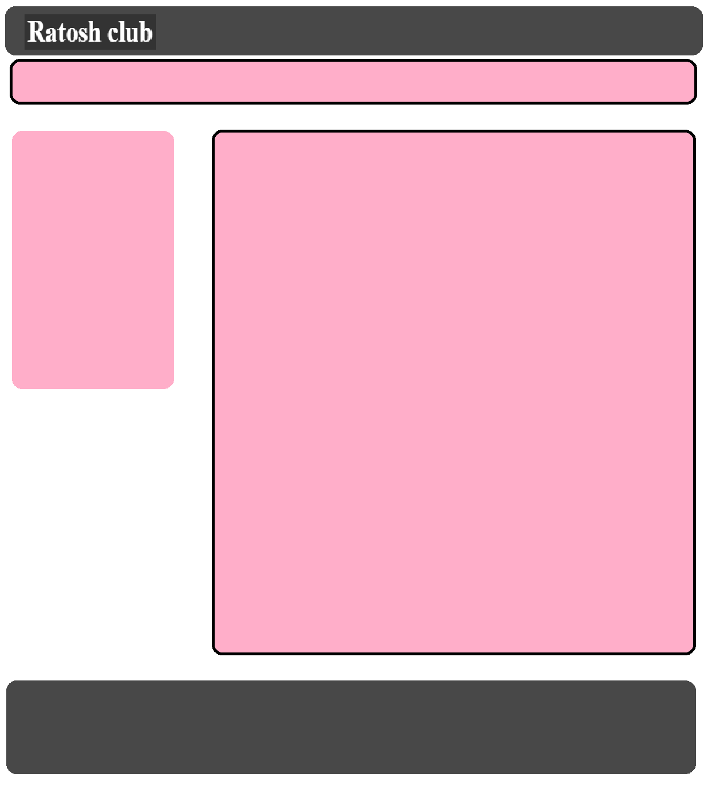
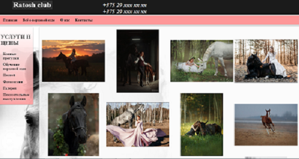
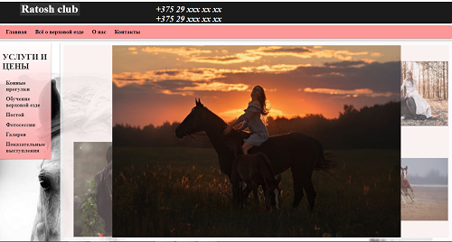
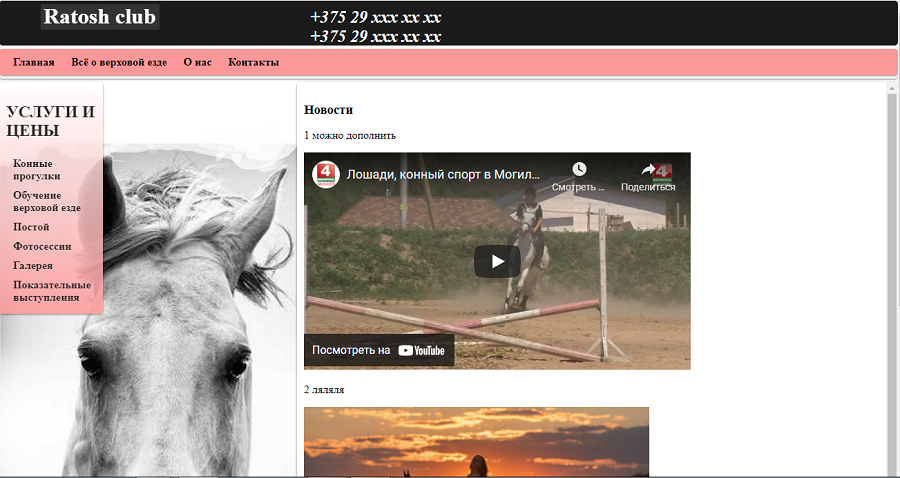
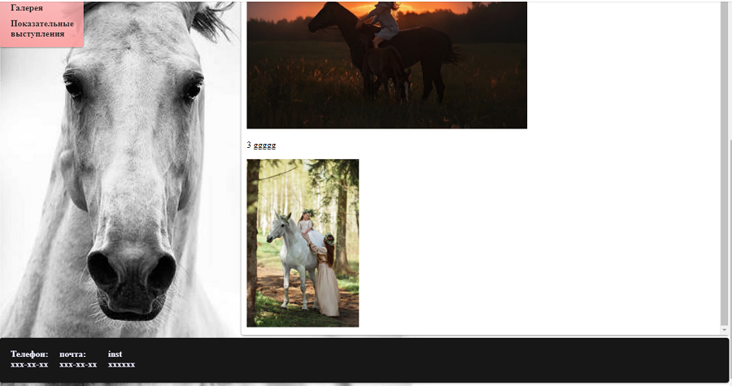

# Курсовая работа 

**Тема: разработка сайта конного клуба.**

**Цель — созданный сайт предназначенного для ознакомления людей с предоставляемыми услугами конного клуба"ROTOSH CLUB".**

# Макет проекта 

***Данный макет реализуется с помощью блочной верстки***

# При создании проекта использовались:

* HTML 5
* CSS 3

# Преимущества данного сайта
 
 * Удобный пользовательский интерфейс
 
 * Наличее большого количества фото и видео информации
 
 * Присудствие галереи
 
 
 
 
# Предварительный просмотор

 

